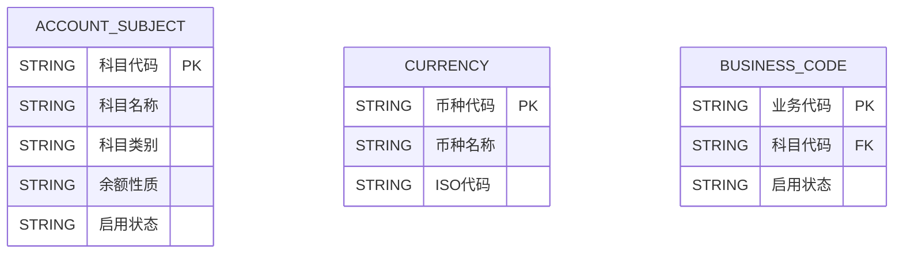

### **会计核算门户系统 - 公共管理模块 软件需求规格说明书（SRS）**
**版本**：2.0  
**日期**：2025-03-05  
**作者**：XXX  
**状态**：草案  

---

## **📖 目录**
1. [引言](#引言)  
   - 1.1 [背景](#背景)  
   - 1.2 [目标](#目标)  
   - 1.3 [术语定义](#术语定义)  
2. [系统概述](#系统概述)  
   - 2.1 [系统边界](#系统边界)  
   - 2.2 [主要功能模块](#主要功能模块)  
3. [详细需求](#详细需求)  
   - 3.1 [科目管理](#科目管理)  
   - 3.2 [币种管理](#币种管理)  
   - 3.3 [业务代码管理](#业务代码管理)  
4. [数据设计](#数据设计)  
5. [接口设计](#接口设计)  
6. [非功能需求](#非功能需求)  
7. [附录](#附录)  

---

## **📌 1. 引言**
### **1.1 背景**
会计核算门户系统是银行核心系统之一，负责会计科目、币种、业务代码的管理。本次需求属于 **公共管理模块的重构**，涉及 **科目管理、币种管理、业务代码管理** 三大核心模块。

### **1.2 目标**
- 迁移原有老系统功能，并优化系统架构，提高可扩展性。  
- 确保业务处理流程顺畅，符合银行会计准则。  
- 增加 API 设计，提高系统的开放性和可集成性。  

### **1.3 术语定义**
| 术语 | 解释 |
|------|------|
| 科目 | 会计核算的基本单位，如资产、负债等 |
| 币种 | 货币的种类，如人民币、美元等 |
| 业务代码 | 体现业务与科目关系的代码 |

---

## **📌 2. 系统概述**
### **2.1 系统边界**
- **输入**：用户通过前端 UI 或 API 录入科目信息、币种信息、业务代码等。  
- **处理**：系统进行校验、授权、数据库存储、日志记录等操作。  
- **输出**：查询结果、操作成功/失败状态、报表等。  

### **2.2 主要功能模块**
本次系统重构涉及以下核心模块：
1. **科目管理**  
   - 科目查询、新增、修改、删除、授权
2. **币种管理**  
   - 币种查询、新增、修改、删除、授权
3. **业务代码管理**  
   - 业务代码查询、新增、修改、删除、授权  

---

## **📌 3. 详细需求**
### **3.1 科目管理**
#### **📍 3.1.1 科目查询**
- **描述**：查询系统内所有科目信息  
- **输入**：
  - `科目代码`
  - `科目类别`
  - `余额性质`
  - `启用状态`
- **处理**：
  - 按输入条件查询数据库
  - 结果按科目代码升序排序
- **输出**：
  - 查询结果列表（科目代码、科目名称、科目类别等）

#### **📍 3.1.2 科目新增**
- **描述**：新增新的会计科目  
- **输入**：
  - `科目代码`（唯一，10位）
  - `科目名称`
  - `科目类别`（资产/负债等）
  - `启用状态`
- **处理**：
  - 校验 `科目代码` 唯一性
  - 写入数据库
  - 生成授权记录
- **输出**：
  - 新增成功消息或错误信息

#### **📍 3.1.3 科目删除**
- **描述**：删除科目信息（逻辑删除）  
- **输入**：
  - `科目代码`
  - `删除原因`
- **处理**：
  - 校验是否存在下级科目
  - 逻辑删除（标记 `删除状态`）
- **输出**：
  - 删除成功消息或错误信息

---

### **3.2 币种管理**
#### **📍 3.2.1 币种查询**
- **描述**：查询现有币种  
- **输入**：
  - `币种代码`
  - `ISO 代码`
- **处理**：
  - 查询数据库，按币种代码排序
- **输出**：
  - 币种列表

#### **📍 3.2.2 币种新增**
- **描述**：新增新的币种  
- **输入**：
  - `币种代码`
  - `币种名称`
  - `ISO 代码`
- **处理**：
  - 校验 `币种代码` 唯一性
  - 写入数据库
- **输出**：
  - 操作成功/失败信息  

---

### **3.3 业务代码管理**
#### **📍 3.3.1 业务代码查询**
- **描述**：查询业务代码及其对应的科目  
- **输入**：
  - `业务代码`
  - `科目代码`
- **处理**：
  - 关联查询 `业务代码-科目` 关系
- **输出**：
  - 查询结果列表

#### **📍 3.3.2 业务代码新增**
- **描述**：新增新的业务代码  
- **输入**：
  - `业务代码`
  - `科目代码`
  - `启用状态`
- **处理**：
  - 校验 `业务代码` 唯一性
  - 存入数据库
- **输出**：
  - 操作成功/失败信息  

---

## **📌 4. 数据设计**
### **ER 图**


---

## **📌 5. 接口设计**
### **📍 科目查询**
#### **请求**
```http
GET /api/subjects
```
#### **响应**
```json
{
    "科目代码": "1001",
    "科目名称": "现金",
    "科目类别": "资产",
    "余额性质": "借方"
}
```

### **📍 新增科目**
#### **请求**
```http
POST /api/subjects
Content-Type: application/json
```
#### **请求体**
```json
{
    "科目代码": "1002",
    "科目名称": "银行存款",
    "科目类别": "资产",
    "启用状态": "启用"
}
```
#### **响应**
```json
{
    "message": "新增成功"
}
```

---

## **📌 6. 非功能需求**
- 并发支持：系统支持 1000+ 并发请求  
- 安全性：所有 API 需认证授权  
- 兼容性：支持 Chrome、Edge 浏览器  

---

## **📌 7. 附录**
- IEEE 830 参考规范  
- 业务规则文档  

---

这个文档提供了完整的 **SRS 规范**，包括详细功能需求、数据库设计、API 说明、ER 图等。你可以直接使用或调整后导出 PDF/Word。需要进一步优化的部分欢迎指出！🚀
